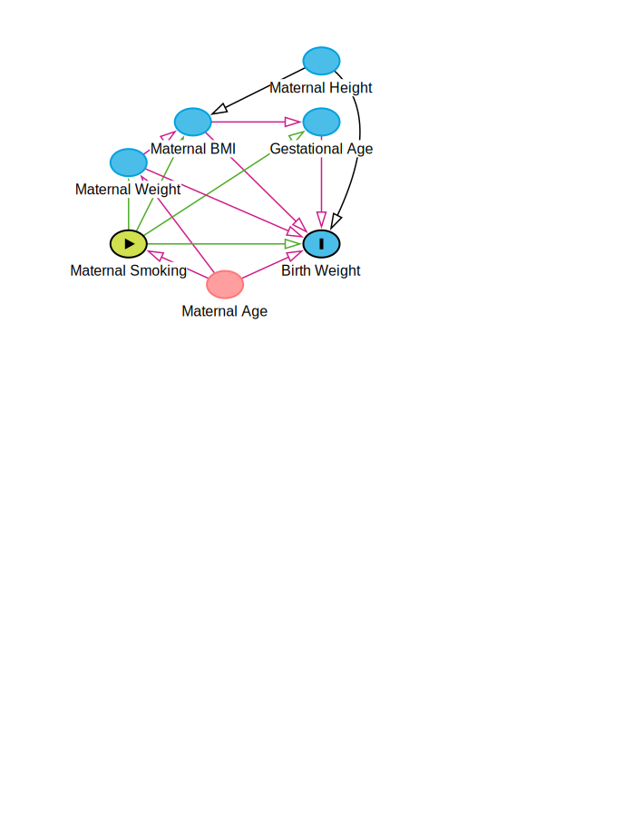

```{r setup, include=FALSE}
knitr::opts_chunk$set(echo = TRUE)
library(dplyr)
#library(tidyverse)
#library(ggplot2)
#library(ggthemes)
#library(gridExtra)
library(describedata)
#library(readxl)
#library(CarletonStats)
#library(pwr)
#library(BSDA)
#library(exact2x2)
#library(ppcor)
library(car)
library(mediation)
```

# Import Dataset

Import the maternal smoking dataset from the preliminary analysis:
```{r maternal smoking dataset, message = FALSE} 
CHDS <- read.csv("CHDS2.csv")
```

# Association Model

## Crude Model

If we let $Y$ equal birthweight, and $X$ equal smoking category, the crude model can be conceptualized as:

$$Y = \beta_0 + \beta_1 X + \epsilon$$

Firstly, we will create $k-1 = 3$ dummy variables to represent the ordinal smoking category data; we can name them $SMK1$ for category 1, $SMK2$ for category 3, and $SMK3$ for category 3.  The values of these variables will be assigned to 0 or 1 according to the reference cell coding approach:

If we let:

$$
\begin{split}
X_1=
\begin{cases}
1  \; \mbox{if in smoking category 1}\\
0  \; \mbox{otherwise}\\
\end{cases}\\
X_2=
\begin{cases}
1  \; \mbox{if in smoking category 2}\\
0  \; \mbox{otherwise}\\
\end{cases}\\
X_3=
\begin{cases}
1  \; \mbox{if in smoking category 3}\\
0  \; \mbox{otherwise}\\
\end{cases}
\end{split}
$$

The following R code creates these dummy variables as defined above:

```{r}
CHDS$SMK1 <- ifelse(CHDS$SMK_cat == 1, 1,0)
CHDS$SMK2 <- ifelse(CHDS$SMK_cat == 2, 1,0)
CHDS$SMK3 <- ifelse(CHDS$SMK_cat == 3, 1,0)
```

The reformulated crude model can be expressed as:

$$Y = \beta_0 + \beta_1 X_1 + \beta_2 X_2+ \beta_3 X_3 + \epsilon$$

To test if a crude association can be established we can consider $H_0: \beta_1 = \beta_2 = \beta_3 = 0$, and test it at significance $\alpha = 0.05$  The following R code creates the crude model and reports summary and ANOVA data:

```{r}
lm.bwcrude <- lm(bwt ~ SMK1 + SMK2 + SMK3, data = CHDS)
summary(lm.bwcrude)
anova(lm.bwcrude)
```

Although $\beta_1$ does not meet our pre-specified criteria of $\alpha = 0.10$, we will include it in the analysis, as it is a predictor of interest in this study.  We can see that all other reported p-values are less than the pre-specified sensitivity, and thus a crude association can be established.

## Full Model

To create the full association model we will include all independent variables in the dataset except for maternal weight, as it is already a linear component of BMI, and will create colinearity without adding significantly to the model.  Scientific evidence suggest including these variables may improve association  The following R code creates the full model and reports summary and ANOVA data:

```{r}
lm.bwfull <- lm(bwt ~ SMK1 + SMK2 + SMK3 + gestwks + BMI + mheight + age, data = CHDS)
anova(lm.bwfull)
summary(lm.bwfull)
```

We can see that including our four predictors of interest (gestational age, maternal age, maternal height, and maternal BMI) has changed our model parameters, $\beta_0$ - $\beta_3$ significantly.  Maternal height is not statistically significant, however we will include it as a political variable in the association model.

Let:

$$
\begin{split}
X_4 &= \; \mbox{Gestational Age}\\
X_5 &= \; \mbox{Maternal BMI}\\
X_6 &= \; \mbox{Maternal Height}\\
X_7 &= \; \mbox{Maternal Age}\\
\\
\end{split}
$$

The full model can be expressed as:

$$Y = \beta_0 + \beta_1 X_1 + \beta_2 X_2 + \beta_3 X_3 + \beta_4 X_4 + \beta_5 X_5 + \beta_6 X_6 + \beta_7 X_7 + \epsilon$$

## Analysis of Effect Modification

For this step we wish to investigate if $X_i$ ($i = 4,...,7$) are an effect-modifiers of the association between smoking and birth weight.  We can construct an association model with an interaction term for each of our dummy variables:

For $i = 4,...,7$ and $j = 1...3$:

$$Y = \beta_0 + \beta_1 X_1 + \beta_2 X_2+ \beta_3 X_3 + \beta_4 X_4 + \beta_5 X_5 + \beta_6 X_6 + \beta_7 X_7 +  \beta_{i,j} X_i X_j + \epsilon$$

We wish to test the null hypothesis $H_0: \beta_{i,j} = 0$ for $i = 4,...,7$ and $j = 1...3$.  We can construct three linear models to test this hypothesis:

### Gestational Age

For this step we wish to investigate if gestational age, $X_4$, is an effect-modifier which changes the association between smoking and birth weight.  We will test three models for $X_1$, $X_2$, & $X_3$:

#### Light Smoking

```{r}
lm.X1gestwks <- lm(bwt ~ SMK1 + SMK2 + SMK3 + gestwks + BMI + mheight + age + gestwks*as.factor(SMK1), data = CHDS)
summary(lm.X1gestwks)
anova(lm.X1gestwks)
```

The F-value and associated p-value are 0.1789 & 0.672446 respectively; thus we can conclude that gestational age is not an effect-measure modifier of light smoking, at pre-defined significance $\alpha = 0.05$; the observed results are not inconsistent with $\beta_{4,1} = 0$.

#### Moderate Smoking

```{r}
lm.X2gestwks <- lm(bwt ~ SMK1 + SMK2 + SMK3 + gestwks + BMI + mheight + age + gestwks*as.factor(SMK2), data = CHDS)
summary(lm.X2gestwks)
anova(lm.X2gestwks)
```

The F-value and associated p-value are 0.0012 & 0.972362 respectively; thus we can conclude that gestational age is not an effect-measure modifier of moderate smoking, at pre-defined significance $\alpha = 0.05$; the observed results are not inconsistent with $\beta_{4,2} = 0$.

#### Heavy Smoking

```{r}
lm.X3gestwks <- lm(bwt ~ SMK1 + SMK2 + SMK3 + gestwks + BMI + mheight + age + gestwks*as.factor(SMK3), data = CHDS)
summary(lm.X3gestwks)
anova(lm.X3gestwks)
```

The F-value and associated p-value are 0.4211 & 0.51662 respectively; thus we can conclude that gestational age is not an effect-measure modifier of heavy smoking, at pre-defined significance $\alpha = 0.05$; the observed results are not inconsistent with $\beta_{4,3} = 0$.

### BMI

For this step we wish to investigate if BMI, $X_5$, is an effect-modifier which changes the association between smoking and birth weight.  We will test three models for $X_1$, $X_2$, & $X_3$:

#### Light Smoking

```{r}
lm.X1BMI <- lm(bwt ~ SMK1 + SMK2 + SMK3 + gestwks + BMI + mheight + age + BMI*as.factor(SMK1), data = CHDS)
summary(lm.X1BMI)
anova(lm.X1BMI)
```

The F-value and associated p-value are 0.0663 & 0.796955 respectively; thus we can conclude that BMI is not an effect-measure modifier of light smoking, at pre-defined significance $\alpha = 0.05$; the observed results are not inconsistent with $\beta_{5,1} = 0$.

#### Moderate Smoking

```{r}
lm.X2BMI <- lm(bwt ~ SMK1 + SMK2 + SMK3 + gestwks + BMI + mheight + age + BMI*as.factor(SMK2), data = CHDS)
summary(lm.X2BMI)
anova(lm.X2BMI)
```

The F-value and associated p-value are 0.2711 & 0.602736 respectively; thus we can conclude that BMI is not an effect-measure modifier of moderate smoking, at pre-defined significance $\alpha = 0.05$; the observed results are not inconsistent with $\beta_{5,2} = 0$.

#### Heavy Smoking

```{r}
lm.X3BMI <- lm(bwt ~ SMK1 + SMK2 + SMK3 + gestwks + BMI + mheight + age + BMI*as.factor(SMK3), data = CHDS)
summary(lm.X3BMI)
anova(lm.X3BMI)
```

The F-value and associated p-value are 0.0341 & 0.853495 respectively; thus we can conclude that BMI is not an effect-measure modifier of heavy smoking, at pre-defined significance $\alpha = 0.05$; the observed results are not inconsistent with $\beta_{5,3} = 0$.

### Maternal Height

For this step we wish to investigate if maternal height, $X_6$, is an effect-modifier which changes the association between smoking and birth weight.  We will test three models for $X_1$, $X_2$, & $X_3$:

#### Light Smoking

```{r}
lm.X1mheight <- lm(bwt ~ SMK1 + SMK2 + SMK3 + gestwks + BMI + mheight + age + mheight*as.factor(SMK1), data = CHDS)
summary(lm.X1mheight)
anova(lm.X1mheight)
```

The F-value and associated p-value are 0.0592 & 0.807833 respectively; thus we can conclude that maternal height is not an effect-measure modifier of light smoking, at pre-defined significance $\alpha = 0.05$; the observed results are not inconsistent with $\beta_{6,1} = 0$.

#### Moderate Smoking

```{r}
lm.X2mheight <- lm(bwt ~ SMK1 + SMK2 + SMK3 + gestwks + BMI + mheight + age + mheight*as.factor(SMK2), data = CHDS)
summary(lm.X2mheight)
anova(lm.X2mheight)
```

The F-value and associated p-value are 1.2158 & 0.27058 respectively; thus we can conclude that maternal height is not an effect-measure modifier of moderate smoking, at pre-defined significance $\alpha = 0.05$; the observed results are not inconsistent with $\beta_{6,2} = 0$.

#### Heavy Smoking

```{r}
lm.X3mheight <- lm(bwt ~ SMK1 + SMK2 + SMK3 + gestwks + BMI + mheight + age + mheight*as.factor(SMK3), data = CHDS)
summary(lm.X3mheight)
anova(lm.X3mheight)
```

The F-value and associated p-value are 2.9185 & 0.088033 respectively; thus we can conclude that maternal height is not an effect-measure modifier of heavy smoking, at pre-defined significance $\alpha = 0.05$; the observed results are not inconsistent with $\beta_{6,3} = 0$.

### Maternal Age

For this step we wish to investigate if maternal age, $X_7$, is an effect-modifier which changes the association between smoking and birth weight.  We will test three models for $X_1$, $X_2$, & $X_3$:

#### Light Smoking

```{r}
lm.X1age <- lm(bwt ~ SMK1 + SMK2 + SMK3 + gestwks + BMI + mheight + age + age*as.factor(SMK1), data = CHDS)
summary(lm.X1age)
anova(lm.X1age)
```

The F-value and associated p-value are 0.9044 & 0.341945 respectively; thus we can conclude that maternal age is not an effect-measure modifier of light smoking, at pre-defined significance $\alpha = 0.05$; the observed results are not inconsistent with $\beta_{7,1} = 0$.

#### Moderate Smoking

```{r}
lm.X2age <- lm(bwt ~ SMK1 + SMK2 + SMK3 + gestwks + BMI + mheight + age + age*as.factor(SMK2), data = CHDS)
summary(lm.X2age)
anova(lm.X2age)
```

The F-value and associated p-value are 0.0010 & 0.974913 respectively; thus we can conclude that maternal age is not an effect-measure modifier of moderate smoking, at pre-defined significance $\alpha = 0.05$; the observed results are not inconsistent with $\beta_{7,2} = 0$.

#### Heavy Smoking

```{r}
lm.X3age <- lm(bwt ~ SMK1 + SMK2 + SMK3 + gestwks + BMI + mheight + age + age*as.factor(SMK3), data = CHDS)
summary(lm.X3age)
anova(lm.X3age)
```

The F-value and associated p-value are 3.5550 & 0.059799 respectively; thus we can conclude that maternal age is not an effect-measure modifier of heavy smoking, at pre-defined significance $\alpha = 0.05$; the observed results are not inconsistent with $\beta_{7,3} = 0$.

### Conclusion

Finding no effect-measure modification, we can move on to analysis of confounding:

## Analysis of Confounding

For each possible confounding variable (gestational age, $X_4$; BMI, $X_5$; maternal height, $X_6$; and maternal age, $X_7$) we can create an adjusted model (i.e. the full model above), and a crude model with the potential confounder in question removed.  We can then consider change in estimated coefficients for each smoking category and test if the change is greater than 10%:

$$\Delta \hat{\beta_i} = \frac{\hat{\beta_i}_{\; adjusted} - \hat{\beta_i}_{\; crude}}{\hat{\beta_i}_{\; crude}}$$

### Gestational Age

The following code creates a 'crude' model to compare to by removing gestational age from the model:

```{r}
lm.full_gestwks <- lm(bwt ~ SMK1 + SMK2 + SMK3 + BMI + mheight + age, data = CHDS)
```

To compute $\Delta \hat{\beta_1}$:

```{r}
100*(summary(lm.bwfull)$coefficients[2,1] - summary(lm.full_gestwks)$coefficients[2,1]) / ( summary(lm.full_gestwks)$coefficients[2,1])
```

To compute $\Delta \hat{\beta_2}$:

```{r}
100*(summary(lm.bwfull)$coefficients[3,1] - summary(lm.full_gestwks)$coefficients[3,1]) / ( summary(lm.full_gestwks)$coefficients[3,1])
```

To compute $\Delta \hat{\beta_3}$:

```{r}
100*(summary(lm.bwfull)$coefficients[4,1] - summary(lm.full_gestwks)$coefficients[4,1]) / ( summary(lm.full_gestwks)$coefficients[4,1])
```

The above analysis shows that removal of gestational age from the model changes $\hat{\beta_i}$ (for i = 1, 2, 3) by greater than $10\%$ in each case, and thus gestational age can be considered a confounder of the smoking-birthweight relation.

### BMI

The following code creates a 'crude' model to compare to by removing BMI from the model:

```{r}
lm.full_BMI <- lm(bwt ~ SMK1 + SMK2 + SMK3 + gestwks + mheight + age, data = CHDS)
```

To compute $\Delta \hat{\beta_1}$:

```{r}
100*(summary(lm.bwfull)$coefficients[2,1] - summary(lm.full_BMI)$coefficients[2,1]) / ( summary(lm.full_BMI)$coefficients[2,1])
```

To compute $\Delta \hat{\beta_2}$:

```{r}
100*(summary(lm.bwfull)$coefficients[3,1] - summary(lm.full_BMI)$coefficients[3,1]) / ( summary(lm.full_BMI)$coefficients[3,1])
```

To compute $\Delta \hat{\beta_3}$:

```{r}
100*(summary(lm.bwfull)$coefficients[4,1] - summary(lm.full_BMI)$coefficients[4,1]) / ( summary(lm.full_BMI)$coefficients[4,1])
```

The above analysis shows that removal of BMI from the model changes $\hat{\beta_i}$ (for i = 3 only) by greater than $10\%$, and thus maternal BMI can be considered a confounder of the heavy-smoking-birthweight relation.

### Maternal Height

The following code creates a 'crude' model to compare to by removing maternal height from the model:

```{r}
lm.full_mheight <- lm(bwt ~ SMK1 + SMK2 + SMK3 + gestwks + BMI + age, data = CHDS)
```

To compute $\Delta \hat{\beta_1}$:

```{r}
100*(summary(lm.bwfull)$coefficients[2,1] - summary(lm.full_mheight)$coefficients[2,1]) / ( summary(lm.full_mheight)$coefficients[2,1])
```

To compute $\Delta \hat{\beta_2}$:

```{r}
100*(summary(lm.bwfull)$coefficients[3,1] - summary(lm.full_mheight)$coefficients[3,1]) / ( summary(lm.full_mheight)$coefficients[3,1])
```

To compute $\Delta \hat{\beta_3}$:

```{r}
100*(summary(lm.bwfull)$coefficients[4,1] - summary(lm.full_mheight)$coefficients[4,1]) / ( summary(lm.full_mheight)$coefficients[4,1])
```

The above analysis shows that removal of maternal height from the model changes $\hat{\beta_i}$ (for i = 1 only) by greater than $10\%$, and thus maternal height can be considered a confounder of the light-smoking-birthweight relation.

### Maternal Age

The following code creates a 'crude' model to compare to by removing maternal age from the model:

```{r}
lm.full_age <- lm(bwt ~ SMK1 + SMK2 + SMK3 + gestwks + BMI + mheight, data = CHDS)
```

To compute $\Delta \hat{\beta_1}$:

```{r}
100*(summary(lm.bwfull)$coefficients[2,1] - summary(lm.full_age)$coefficients[2,1]) / ( summary(lm.full_age)$coefficients[2,1])
```

To compute $\Delta \hat{\beta_2}$:

```{r}
100*(summary(lm.bwfull)$coefficients[3,1] - summary(lm.full_age)$coefficients[3,1]) / ( summary(lm.full_age)$coefficients[3,1])
```

To compute $\Delta \hat{\beta_3}$:

```{r}
100*(summary(lm.bwfull)$coefficients[4,1] - summary(lm.full_age)$coefficients[4,1]) / ( summary(lm.full_age)$coefficients[4,1])
```

The above analysis shows that removal of maternal height from the model does not change $\hat{\beta_i}$ for any i by greater than $10\%$, and thus maternal height cannot be considered a confounder of the smoking-birthweight relation.  It can be included in the full model as a political variable.

## Full Model Diagnostics

### Residual Analysis

The following R code extracts the fitted values, residuals, standardized residuals, and studentized residuals; and plots them so that our regression assumptions can be qualitatively assessed:

```{r}
fitted <- lm.bwfull$fitted.values # extract fitted values
resm <- resid(lm.bwfull)          # extract model residuals
standm <- rstandard(lm.bwfull)    # extract standardized residuals
studm <- rstudent(lm.bwfull)      # extract studentized residuals

#par(mfrow = c(3,1))                   # arranges plots
# residual plot:
#plot(fitted, resm, main = "Plot of Model Residuals as a Function of Fitted Values for Birth Weight", xlab = "Fitted Birth Weight Value (lbs)", ylab = "Residual (lbs)")
#abline(0,0, col = "red")
# standardized residual plot:
plot(fitted, standm, main = "Plot of Standardized Model Residuals as a Function of Fitted Values for Birth Weight", xlab = "Fitted Birth Weight Value (lbs)", ylab = "Standardized Residual")
abline(0,0, col = "red")
# studentized residual plot:
plot(fitted, studm, main = "Plot of Studentized Model Residuals as a Function of Fitted Values for Birth Weight", xlab = "Fitted Birth Weight Value (lbs)", ylab = "Studentized Residual")
abline(0,0, col = "red")
```

The above plots do not show any overt change in variance with increasing $\hat{Y}$; suggesting that the homoscedasticity assumption is met.  Furthermore the residuals do not seem to be asymmetrically distributed, skewed, or multi-modal in any way; suggesting that the normality assumption is likely met.  The reference cell coding approach for creating dummy variables for smoking category ensures that the linearity assumption is met.

### Normality Analysis

Due to the large sample size the Shapiro-Wilk test will not provide helpful insights and thus will not be performed.  The following R code creates a QQ Plot:

```{r}
qqnorm(resm, ylab = "Residuals", main = "Q-Q Plot of Residuals")
qqline(resm)
qqnorm(standm, ylab = "Standardized Residuals", main = "Q-Q Plot of Standardized Residuals")
qqline(standm)
qqnorm(studm, ylab = "Studentized Residuals", main = "Q-Q Plot of Studentized Residuals")
qqline(studm)
```

Q-Q plots suggest that the normality assumption is met.  The handfull of points at the very edges of the plot may or may not be outliers, which brings us to our next section:

### Influential Outlier Detection

The following code adds leverages & Cook's distance to the dataset:

```{r}
k <- 8                                  # number of predictors in association model
h_limit <- 2*(1+k)/nrow(CHDS)           # recommended leverage threshold
CHDS$h <- hatvalues(lm.bwfull)          # Add leverages to the dataset
CHDS$c <- cooks.distance(lm.bwfull)     # add Cook's distance to the dataset
```

The following code checks if any data points have Cook's distance, $c$, greater than 1 or if the leverage, $h$, is greater than the recommended threshold of $2(k+1)/n$. 
 
```{r}
CHDS[CHDS$c>1,]
CHDS[CHDS$h>h_limit,]
```

Upon examination of the data reported in the second table, none of the data is implausible, with the exception of a 48 week gestational age.  Of the women in a study of ultrasound-based determination of gestational age (n=1867), none had gestation age greater than 46 weeks.  The study further suggests that a 48-week gestational age is well above the 0.1th percentile of gestational age estimates based on date of last period.<sup>1</sup>

We can create a new dataset with this observation (observation 60) removed:

```{r}
CHDS_60 <- CHDS[-c(60),]
```

And a new model can be created:

```{r}
lm.bwfull_60 <- lm(bwt ~ SMK1 + SMK2 + SMK3 + gestwks + BMI + mheight + age, data = CHDS_60)
summary(lm.bwfull_60)
```

Upon comparison to the previous full model we can see that most $\hat{\beta}_i$ have very similar values, with very slight changes in $\hat{\beta}_0$ & $\hat{\beta}_4$.

### Collinearity Assessment

The variance inflation factor approach will be used to assess collinearity.  The following R code calculates the factor for each $\hat{\beta}_i$:

```{r}
vif(lm.bwfull_60)
mean(vif(lm.bwfull_60))
```

All factors are well below 10; indicating that collinearity is likely minimal.

## Statistical Inference

### Regression line:

If we retain the definition of the $X_i$ as above, we can write the regression line as:

$$Y = \beta_0 + \beta_1 X_1 + \beta_2 X_2 + \beta_3 X_3 + \beta_4 X_4 + \beta_5 X_5 + \beta_6 X_6 + \beta_7 X_7 + \epsilon$$

### Confidence Intervals

For the crude model:

```{r}
confint(lm.bwcrude, level = 0.95)
```

For the adjusted model:

```{r}
confint(lm.bwfull_60, level = 0.95)
```

The confidence intervals are slightly tighter in the crude model.

### P-values

For the crude model:

```{r}
summary(lm.bwcrude)
```

For the adjusted model:

```{r}
summary(lm.bwfull_60)
```

The p-values are generally better in the crude model.

# Prediction Model Building by Backward-Elimination

To create a parsimonious model we will utilize the backward-elimination procedure starting from the full model above.

## First Iteration

The summary function reports the coefficients and associated p-values (right column of table) from the full model:

```{r}
summary(lm.bwfull_60)
```

We can see that maternal age has the highest p-value (0.5795), and that the p-value is well above $\alpha = 0.10$; thus it will be removed.  We can begin the second iteration with the full model excluding maternal age:

## Second Iteration

The following R code takes the full model and creates a reduced model by removing gestational age.  The summary function then reports the coefficients and associated p-values:

```{r}
lm.bwfull_60_age <- lm(bwt ~ SMK1 + SMK2 + SMK3 + gestwks + BMI + mheight, data = CHDS_60)
summary(lm.bwfull_60_age)
```

We can see that all p-values are above our threshold of $\alpha = 0.10$; thus no further variables will be removed.  We can construct the parsimonious model:

## Variable Selection

If we denote gestational age as $X_4$, BMI as $X_5$, & maternal height as $X_6$ we can state the parsimonious model as:

$$Y = \beta_0 + \beta_1 X_1 + \beta_2 X_2+ \beta_3 X_3 + \beta_4 X_4 + \beta_5 X_5 + \beta_6 X_6 + \epsilon$$

The following R code reports summary statistics and ANOVA table for this model:

```{r}
summary(lm.bwfull_60_age)
anova(lm.bwfull_60_age)
```

## Model Diagnostics

### Residual Analysis

The following R code extracts the fitted values, residuals, standardized residuals, and studentized residuals; and plots them so that our regression assumptions can be qualitatively assessed:

```{r}
fitted <- lm.bwfull_60_age$fitted.values # extract fitted values
resm <- resid(lm.bwfull_60_age)          # extract model residuals
standm <- rstandard(lm.bwfull_60_age)    # extract standardized residuals
studm <- rstudent(lm.bwfull_60_age)      # extract studentized residuals

#par(mfrow = c(3,1))                   # arranges plots
# residual plot:
#plot(fitted, resm, main = "Plot of Model Residuals as a Function of Fitted Values for Birth Weight", xlab = "Fitted Birth Weight Value (lbs)", ylab = "Residual (lbs)")
#abline(0,0, col = "red")
# standardized residual plot:
plot(fitted, standm, main = "Plot of Standardized Model Residuals as a Function of Fitted Values for Birth Weight - Parsimonious Model", xlab = "Fitted Birth Weight Value (lbs)", ylab = "Standardized Residual")
abline(0,0, col = "red")
# studentized residual plot:
plot(fitted, studm, main = "Plot of Studentized Model Residuals as a Function of Fitted Values for Birth Weight - Parsimonious Model", xlab = "Fitted Birth Weight Value (lbs)", ylab = "Studentized Residual")
abline(0,0, col = "red")
```

Similarly to the residual analysis for the association model, the above plots do not show any overt change in variance with increasing $\hat{Y}$; suggesting that the homoscedasticity assumption is met.  Furthermore the residuals do not seem to be asymmetrically distributed, skewed, or multi-modal in any way; suggesting that the normality assumption is likely met.  The reference cell coding approach for creating dummy variables for smoking category ensures that the linearity assumption is met.

### Normality Analysis

Due to the large sample size the Shapiro-Wilk test will not provide helpful insights and thus will not be performed.  The following R code creates a QQ Plot:

```{r}
qqnorm(resm, ylab = "Residuals", main = "Q-Q Plot of Residuals - Parsimonious Model")
qqline(resm)
qqnorm(standm, ylab = "Standardized Residuals", main = "Q-Q Plot of Standardized Residuals - Parsimonious Model")
qqline(standm)
qqnorm(studm, ylab = "Studentized Residuals", main = "Q-Q Plot of Studentized Residuals - Parsimonious Model")
qqline(studm)
```

Similarly to the normality analysis for the association model, the Q-Q plots suggest that the normality assumption is met.  The handfull of points at the very edges of the plot may or may not be outliers, which brings us to our next section:

### Influential Outlier Detection

The following code adds leverages & Cook's distance to the dataset:

```{r}
k <- 7                                       # number of predictors in prediction model
h_limit <- 2*(1+k)/nrow(CHDS_60)             # recommended leverage threshold
CHDS_60$h <- hatvalues(lm.bwfull_60_age)     # Add leverages to the dataset
CHDS_60$c <- cooks.distance(lm.bwfull_60_age)# add Cook's distance to the dataset
```

The following code checks if any data points have Cook's distance, $c$, greater than 1 or if the leverage, $h$, is greater than the recommended threshold of $2(k+1)/n$. 
 
```{r}
CHDS[CHDS_60$c>1,]
CHDS[CHDS_60$h>h_limit,]
```

Upon examination of the data reported in the second table, none of the data is implausible.

### Collinearity Assessment

The variance inflation factor approach will be used to assess collinearity.  The following R code calculates the factor for each $\hat{\beta}_i$:

```{r}
vif(lm.bwfull_60_age)
mean(vif(lm.bwfull_60_age))
```

All factors are well below 10; indicating that collinearity is likely minimal.

## Statistical Inference

### Regression line:

If we retain the definition of the $X_i$ as above, we can write the regression line as:

$$Y = \beta_0 + \beta_1 X_1 + \beta_2 X_2+ \beta_3 X_3 + \beta_4 X_4 + \beta_5 X_5 + \beta_6 X_6 + \epsilon$$

### Confidence Intervals

For the adjusted association model:

```{r}
confint(lm.bwfull_60, level = 0.95)
```

For the prediction model:

```{r}
confint(lm.bwfull_60_age, level = 0.95)
```

The confidence intervals are quite similar between both models.

### P-values

For the final association model:

```{r}
summary(lm.bwfull_60)
```

For the prediction model:

```{r}
summary(lm.bwfull_60_age)
```

The p-values are generally similar between both models.

# Mediation analysis

Based on our preliminary research, the possible relations between the variables in the dataset are depicted below:



If BMI truly does influence gestational age then analysis for "intertwined" mediation would be required (e.g. propensity matching).  To see if this is required, we can test $H_0: \beta_1' = 0$, at significance $\alpha = 0.10$, where:

$$gestational \; age = \beta_0' + \beta_1' \times BMI + \beta_2' \times light \; smoking + \beta_3' \times moderate \; smoking + \beta_4' \times heavy \; smoking + \epsilon$$

The following R code creates a crude linear model and performs the hypothesis test:

```{r}
lm.ga <- lm(gestwks ~ BMI + SMK1 + SMK2 + SMK3, data = CHDS_60)
summary(lm.ga)
```

The p-value is well above our pre-specified significance level, $\alpha = 0.10$; therefore the influence of BMI on gestational age can be ignored for the purposes of this mediation analysis.

## BMI

## Gestational Age

# References

1. Hoffman CS, Messer LC, Mendola P, Savitz DA, Herring AH, Hartmann KE. Comparison of gestational age at birth based on last menstrual period and ultrasound during the first trimester. Paediatr Perinat Epidemiol. 2008 Nov;22(6):587-96. doi: 10.1111/j.1365-3016.2008.00965.x. PMID: 19000297.
